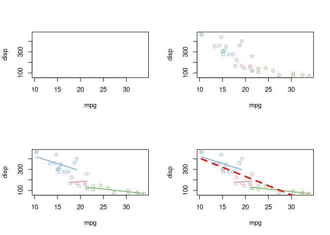

<!-- README.md is generated from README.Rmd. Please edit that file -->

# Grammar of Graphics for base plot

## Aesthetic mapping

`amp()` for **a**esthetic **m**a**p**ping, that equivalents to
`ggplot2::aes()`.

``` r
library(bbplot)

p <- bbplot(mtcars, amp(mpg, disp, col=factor(cyl)))
p1 <- p %>% ly_point
p2 <- p %>% ly_point %>% ly_lm(amp(group=cyl), lwd=2)
p3 <- p2 %>% ly_lm(col="red", lwd=3, lty=2)
par(mfrow=c(2,2))
p; p1; p2; p3
```

<!-- -->

## Setting labels

``` r
p2 %>% bblabs(title = "hello", sub = "just for demo",
              xlab="this is xlab", ylab = "this is ylab")
```

<!-- -->

## Theme

``` r
g <- p2 %>%
     bbtheme(col.main="red", cex.main=2,
             mar = c(4, 4, 3, 1)) %>%
     bbtitle("applying graphics::par")
par(mfrow=c(1,2))
print(g)
p2 %>% bbtitle("theme has no side effect")
```

<!-- -->
