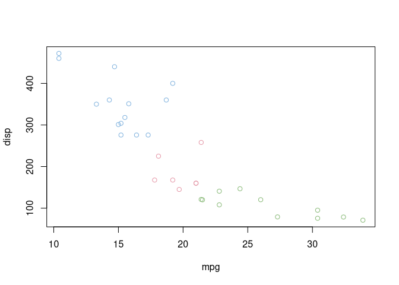
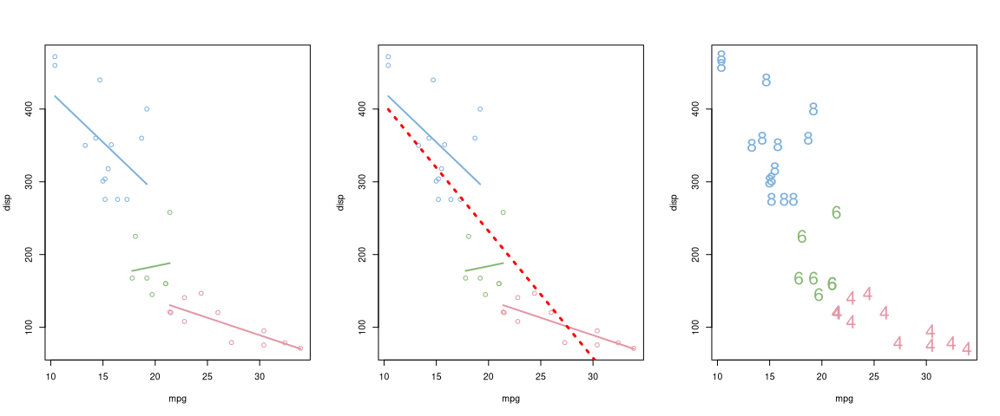
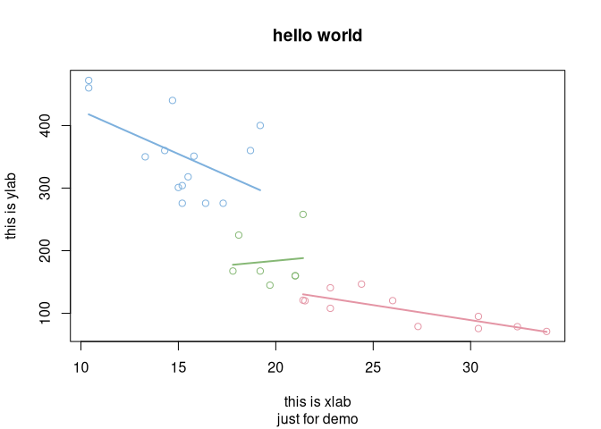
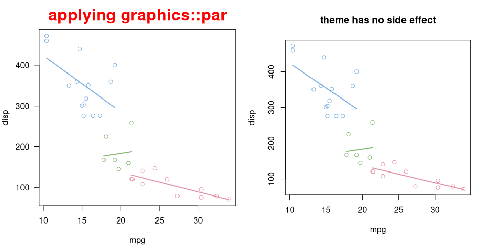
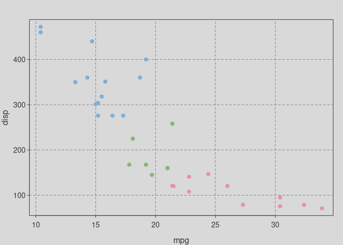
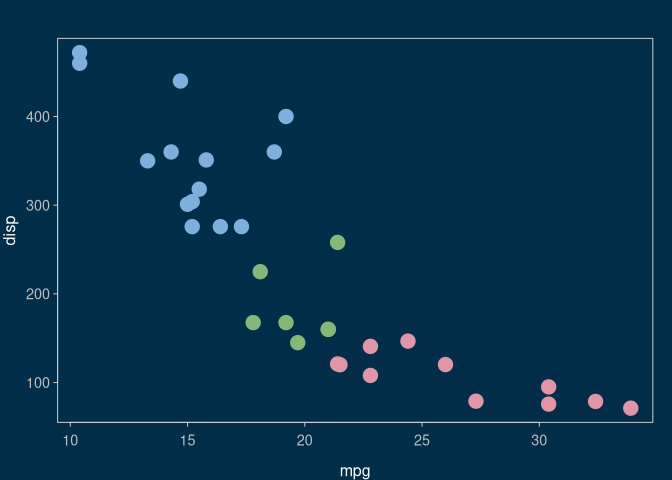
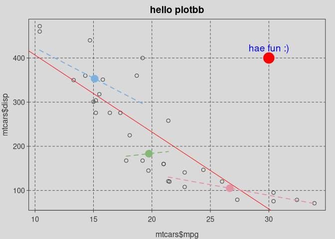

<!-- README.md is generated from README.Rmd. Please edit that file -->

# Grammar of Graphics for base plot

## Aesthetic mapping

`bb_aes()` for aesthetic mapping, that equivalents to `ggplot2::aes()`.

``` r
library(plotbb)

p <- bbplot(mtcars, bb_aes(mpg, disp, col=factor(cyl)))
p + bb_grid(col='grey50', lty='dashed') + bb_point(pch=19)
```

<!-- -->

## Geometric layer

``` r
p2 <- p + bb_point() + bb_lm(bb_aes(group=cyl), lwd=2)
p3 <- p2 + bb_lm(col="red", lwd=3, lty='dotted')
par(mfrow=c(1,2))
p2; p3
```

<!-- -->

### TODO

  - [x] bb\_grid
  - [x] bb\_point
  - [x] bb\_lm
  - more layers need to be added

## Setting labels

``` r
p2 + bb_labs(title = "hello", sub = "just for demo",
              xlab="this is xlab", ylab = "this is ylab") +
  bb_title("hello world") # last one rules            
```

<!-- -->

## Theme

``` r
g <- p2 +
     bb_theme(col.main="red", cex.main=2,
             mar = c(4, 4, 3, 1)) +
     bb_title("applying graphics::par")
par(mfrow=c(1,2))
print(g)
p2 + bb_title("theme has no side effect")
```

<!-- -->

`bb_theme` has no side effect and will only apply to the `bbplot` object
that it added to. This is very important for developing pre-defined
themes.

``` r
par(mfrow=c(1,2))
p3 + bb_theme_expand()
print(p3)
```

<!-- -->

``` r
p + bb_grid(col='grey50', lty='dashed') +
  bb_point(pch=19) +
  bb_theme_expand() +
  bb_theme_grey()
```

<!-- -->

``` r
p + bb_point(pch=19, cex=2) +
  bb_theme_expand() +
  bb_theme_deepblue()
```

<!-- -->

### TODO

  - [x] bb\_theme\_expand
  - [x] bb\_theme\_grey
  - [x] bb\_theme\_deepblue
  - develop more pre-defined themes

## Scale

Not yet implemented

## Legend

Not yet implemented

## Using existing code with plotbb

Suppose we have existing code to plot something:

``` r
plot(mtcars$mpg, mtcars$disp)
abline(lm(disp ~ mpg, data=mtcars), col='red')
```

We can wrap the codes into a function:

``` r
f <- function() {
  plot(mtcars$mpg, mtcars$disp)
  abline(lm(disp ~ mpg, data=mtcars), col='red')
}
```

Then we can convert it to a `bbplot` object. The plot produced by the
function will be used as the canvas, and we can apply theme and add
layers to it:

``` r
library(dplyr)
d <- group_by(mtcars, cyl) %>%
  summarize(xm=mean(mpg), ym=mean(disp))

as.bbplot(f) +
   bb_theme_expand() +
   bb_theme_grey() +
   bb_lm(bb_aes(mpg, disp, group=cyl, col=factor(cyl)), data=mtcars, lwd=2, lty='dashed') +
   bb_point(bb_aes(xm, ym, col=factor(cyl)), data=d, pch=19, cex=2) +
   bb_title("hello plotbb") +
   bb_grid(col='grey30', lty='dashed') ## grid lines were plotted as background by default
```

<!-- -->
